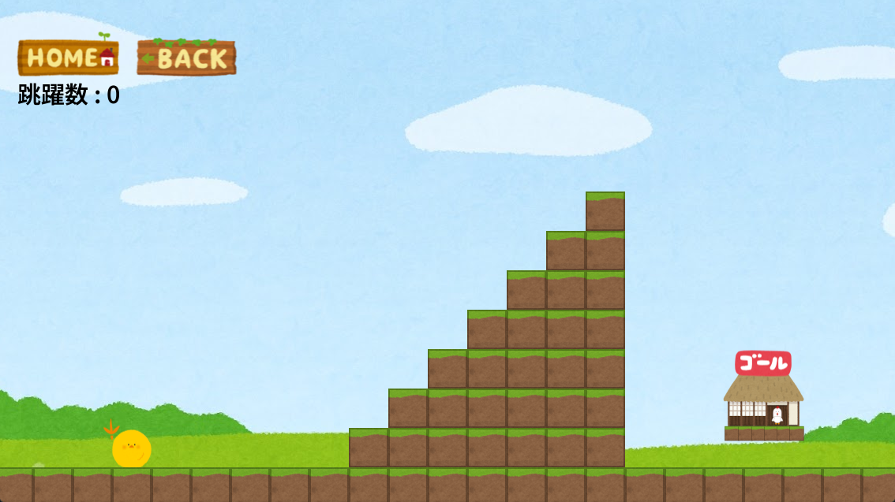
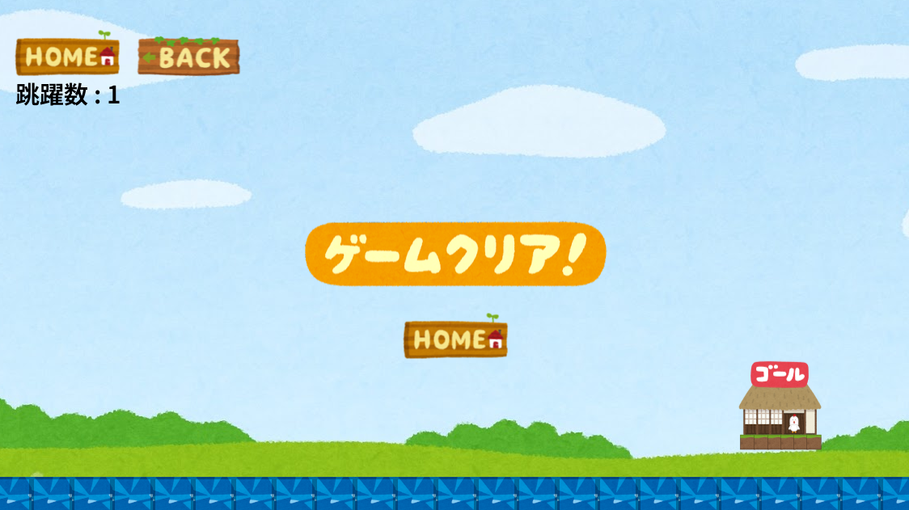

# ひよこの帰り道

## URL

https://play.google.com/store/apps/details?id=org.cocos2dx.ChickWayHome

## ゲーム概要

ひよこを弾いて家までゴールさせるゲームです。

途中には様々なアイテムやギミック、そして障害物が待ち構えています。

## 制作期間

2023/11/01 ～ 2023/11/30

## 開発環境

★言語

　C、C++

★ゲームエンジン

　Cocos2dx

★外部ライブラリ

　SQLite3
 
　https://www.sqlite.org/index.html

## 設計書

[クラス図.xlsx](./クラス図.xlsx)

## 操作機能

タップ

## ゲーム詳細

★メイン画面

　ゲームが起動すると、メイン画面が表示します。
 
　メイン画面をタップすると、ステージ選択画面へ遷移します。

★ステージ選択画面

　ステージボタンをタップすると、ゲーム画面へ遷移します。

　合計30のステージが用意されており、最初のステージから順に難易度がじわじわと高まっていきます。

　ステージをクリアすると、ひよこを弾いた回数に応じて、ステージボタンに星の得点が設定されます。

 ★ゲーム画面

　ひよこをゴールまで弾きます。
 
　たくさん弾いた数ほど、ステージ選択画面のボタンには星の得点が削られます。

　
　
